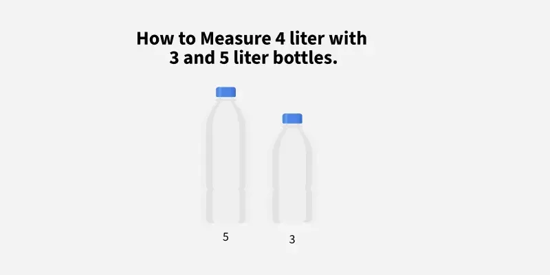
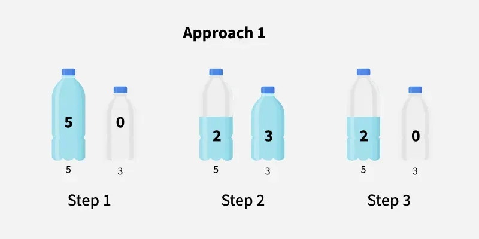
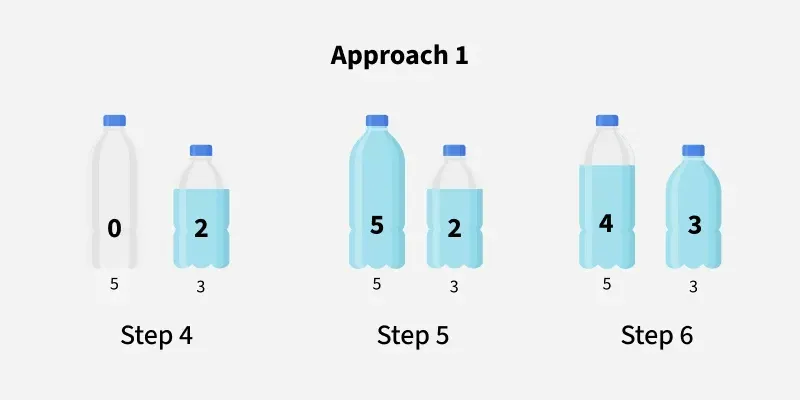
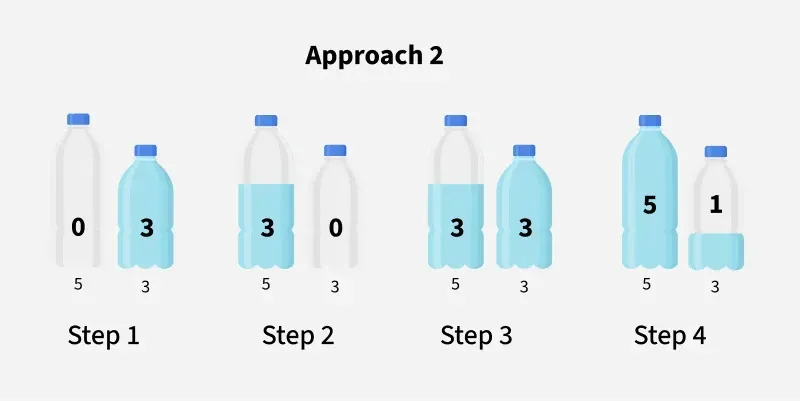
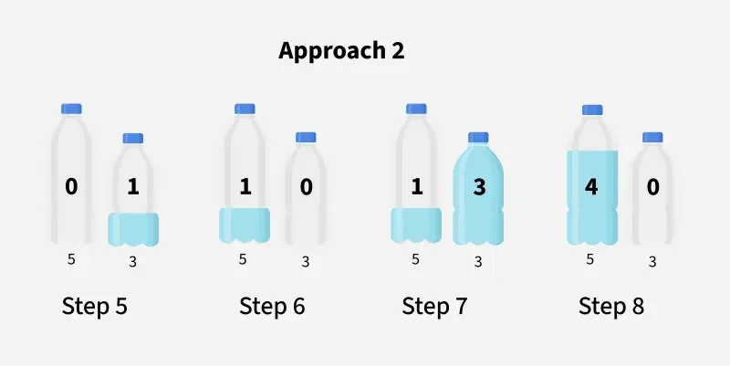

<h1>💧 Day 1 Puzzle | Measure 4 Litres with 3L and 5L Bottles</h1>

<h2>🧠 Puzzle Statement</h2>

You have two bottles:  
- One that can hold exactly <b>3 liters</b> of water.  
- Another that can hold exactly <b>5 liters</b> of water.  

Your goal is to measure out <b>precisely 4 liters</b> of water using only these two bottles.

You are allowed to:  
- Fill either of the bottles fully.  
- Empty either bottle.  
- Pour water from one bottle to the other until one is either full or empty.  

<blockquote>❌ No additional measuring tools or markings allowed.</blockquote>

---

<h2>📸 Puzzle Illustration</h2>

---

<h2>✅ Solution</h2>

This puzzle can be solved using <b>two approaches</b>. Both lead to exactly 4 liters in one of the bottles.

---

<h3>🔁 Approach 1 (6 Steps - Optimal)</h3>

  

1. Fill the 5-liter bottle. (5, 0)  
2. Pour into the 3-liter bottle. (2, 3)  
3. Empty the 3-liter bottle. (2, 0)  
4. Pour remaining 2L from 5L to 3L. (0, 2)  
5. Fill 5-liter bottle again. (5, 2)  
6. Pour into the 3-liter bottle (needs 1L), leaving <b>4 liters</b> in the 5-liter bottle. ✅  
   Final state: <b>(4, 3)</b>

---

<h3>🔁 Approach 2 (8 Steps)</h3>

1. Fill 3-liter bottle. (0, 3)  
2. Pour into 5-liter bottle. (3, 0)  
3. Fill 3-liter again. (3, 3)  
4. Pour into 5-liter (now 5L full, 1L left in 3L). (5, 1)  
5. Empty 5-liter bottle. (0, 1)  
6. Pour 1L from 3L to 5L. (1, 0)  
7. Fill 3-liter again. (1, 3)  
8. Pour into 5-liter.  
   Final state: <b>(4, 0)</b> ✅

---

<h2>🗂️ Images in this folder</h2>

- <code>water-measure-main.webp</code> → Puzzle layout  
- <code>water-measure-1.webp</code> → Steps 1-3 of Approach 1  
- <code>water-measure-2.webp</code> → Steps 4-6 of Approach 1  
- <code>water-measure-2-1.webp</code> → All steps of Approach 2  

---

<h2>🧠 Conclusion</h2>

This classic water jug problem is a favorite in interviews to test logical reasoning, sequencing, and minimal-step problem solving.

---

✅ Stay tuned for <b>Day 2 Puzzle</b> tomorrow!

